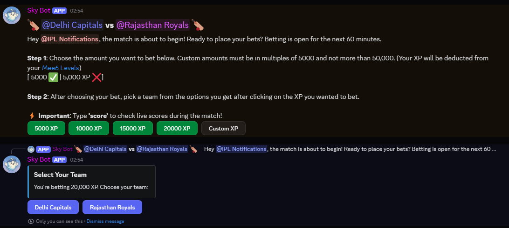
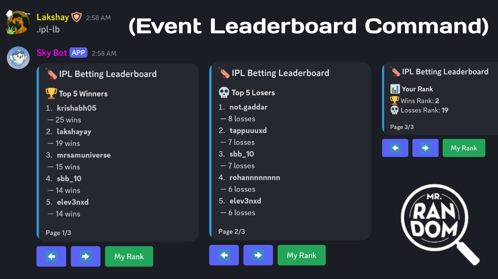
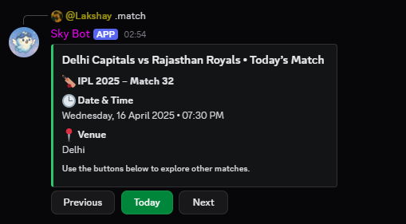
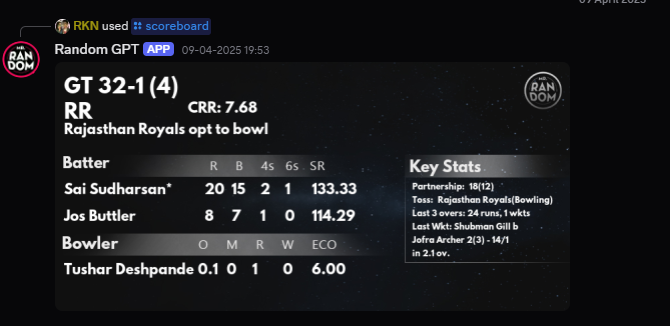
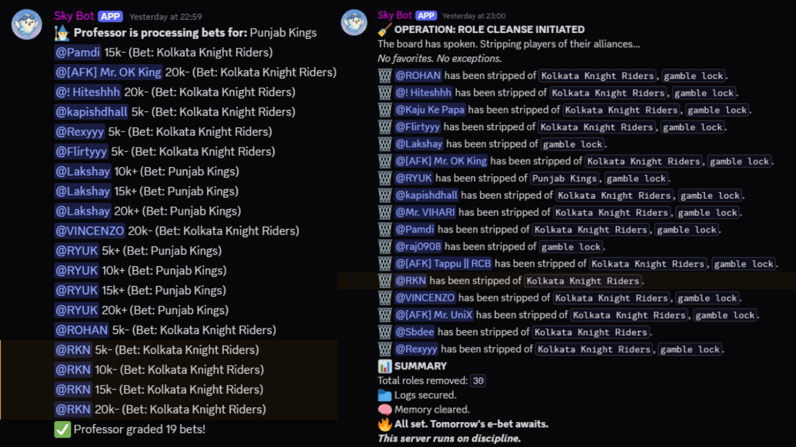
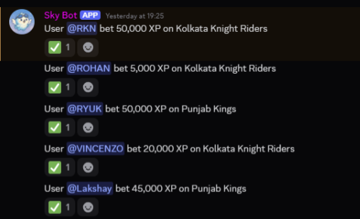
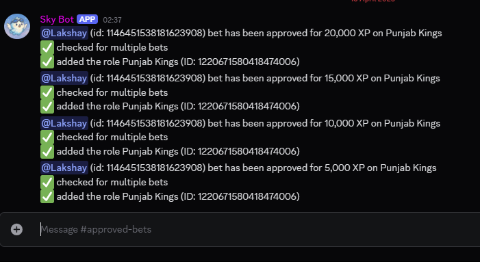
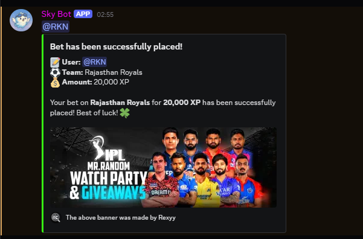
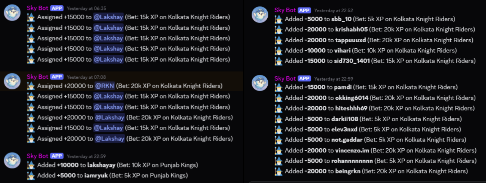
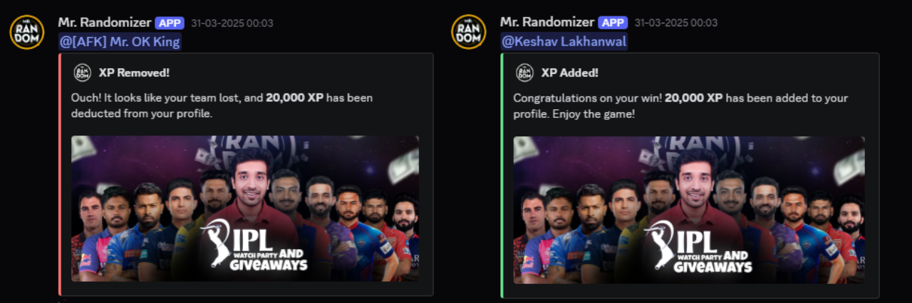

# 🏏 IPL 2025 Discord Betting Event

Welcome to the **IPL 2025 Betting Panel**, proudly hosted by **Mr. Random’s Discord Server**!  
Think you know cricket? Put your XP on the line and win big. With random refunds, live scores, custom commands, and Nitro prizes — this season’s gonna be wild.

Managed and maintained by 👨‍💻 **Lakshay** and 👨‍💻 **RKN**, the brains behind the development.

---

## 📅 When It Happens

- **1 hour before each IPL match**, the betting panel opens in `#events`.
- It stays open until **15 minutes before** the match begins.
- You'll have that window to place your bets!

---

## 🎮 How Betting Works

- Bet using your **Discord XP**, based on your level.
- Choose the team you think will **win** the match.
- If your team **wins** ➜ you earn XP.
- If your team **loses** ➜ XP is deducted — BUT...

### 🎲 Random Refunds

Even if you lose, **Mr. Random’s magic** might bless you with a partial XP refund.  
The % refund is based on **pure randomness** AND your **server activity**.

> 👥 **The more active you are in the server, the higher your refund chance.**  
> Stay engaged, chat around, and let Mr. Random reward you for it!

| Scenario         | What Happens                                   |
|------------------|------------------------------------------------|
| Your team wins   | You earn bonus XP (rewarded based on bet)     |
| Your team loses  | You lose XP, but get a random partial refund! |
| No show / no bet | Nothing happens                                |

---

## ✅ How To Place A Bet

1. Head over to `#events` when the panel is live.
2. Enter the XP you want to bet, and confirm.
3. You’ll see options to choose a team.
4. Sit back and enjoy the match — XP will be updated after it's over.

---

## ⚠️ Quick Rules & Tips

- 🕒 You can only bet while the panel is open — **1 hour to 15 minutes** before the match.
- 💬 No spam in `#general-chat`. Use `#help-and-suggest` if you have issues.
- 🎲 Refunds are random. Don't ask how. It's Mr. Random's will.

---

## 🏆 End-of-Season Rewards

At the end of the IPL season:

- **Top XP earners** through betting will be rewarded.
- 🎁 **Discord Nitro** for the top performers!
- Special shout-outs and maybe some bonus surprises 👀

---

## 📊 Commands You Can Use

### `.ipl-lb`
- View your **rank** on the leaderboard.
- See **top winners**, **top losers**, and where you stand.
  

### `.match`
- Get a full IPL schedule
- Never miss a game again!
  

### `score` (used in regular messages)
- Just type **“score”** anywhere in a message.
- You’ll instantly get the **latest live IPL score** in short format.
  

### `/scoreboard`
- Use this command to get a **full match breakdown**:
  - Player stats
  - Fall of wickets
  - Partnerships
  - Extras and more!
    

---

## 📝 Summary Table

| Feature                | What It Does                                             |
|------------------------|----------------------------------------------------------|
| Betting Panel          | Bet XP on the winning team                               |
| Random Refunds         | Lose? Get some XP back, based on activity + randomness   |
| Leaderboard (`.ipl-lb`) | Shows top winners, losers, and your rank                |
| Schedule (`.match`)    | View today, tomorrow & yesterday’s matches              |
| Quick Score            | Type “score” to get live update                         |
| Full Scoreboard        | Use `/scoreboard` for detailed match stats              |
| Season Rewards         | Nitro prizes for top bettors                            |

---

## 🧠 Betting Tips

- Bet smart — not just emotionally.
- Keep an eye on team forms and matchups.
- Don't risk it all in one go (unless you love chaos).
- Be active to boost your refund chances!
---

## 🧠 Fair Play & Automation

### 🧾 Weekly XP Taxes

To keep things fair for **non-bettors** and prevent farming:
- **Top betting winners** will be taxed **every weekend**.
- A small % of their gained XP will be collected as a **“balance tax.”**

> ⚖️ Keeps the playing field level and fun for everyone!

---

### 💸 XP Betting Limits

- To maintain fairness and prevent leaderboard exploitation, Betable XP is capped at **50,000**.
- This ensures no user can gain an unfair advantage through excessive betting.

> 🚫 Prevents leaderboard abuse through excessive XP betting.

---

### 🤖 Meet the Bet Professor

We call it **The Bet Professor** (originally Bet Processor) — our very own AI that handles the boring stuff:

- Automatically logs and processes **who bet what on which team**
- Calculates winners and adjusts XP
- Cleans up all bets and resets the panel for the **next event**

> ✅ No manual work. No delays. All handled by AI. Clean and smooth betting!

---

## 🧪 Behind the Scenes – The Magic of the Backend

This entire IPL system runs like a well-oiled XP machine — thanks to our talented developers:  
**👨‍💻 Godz** and **👨‍💻 RKN**, the brains behind the operation.

Here’s exactly how everything works behind the scenes:

---

### ✅ Step 1: Bet Placement Logged

- Once a user clicks the button and places a bet successfully, the **raw betting data** is instantly logged in our **backend channels**.
- This includes:
  - Who bet
  - How much XP
  - Which team they chose

---

### 🔄 Step 2: Bot Processing

- Bots take this raw data and **convert it into a readable and displayable format**.
- This is mainly for internal clarity — makes it easier to double-check everything.
  

---

### 📢 Step 3: Public Bet Display

- The processed bet information is **posted publicly** in the `#server-notifs` channel.
- Everyone can see who bet on what and for how much — 100% transparency.
  

---

### 🏁 Step 4: Match Ends — Bet Resolution

- After the match ends and we have a result, the **Bet Professor** steps in.
- It processes all bets, checks which team won, and **removes or rewards XP** accordingly.
  

---

### 📢 Step 5: Final XP Outcome Display

- The final XP results (who gained, who lost, and how much) are then **automatically sent to the public `#server-notifs`** channel.
- This is where users get to see how they performed after the match.
  

---

> 💡 Every step is automated, traceable, and built with transparency in mind — all thanks to our team’s magic.

---

## ❓ Need Help?

Got questions or facing an issue?  
Just ask in the `#help=and-suggest` channel or ping one of the mods — we’ve got your back.

Let the XP battles begin. May your bets be bold, your teams victorious, and your refunds generous.  
**Good luck, May the XP gods and Mr. Random be in your favor.** 🎲🔥🏏

---

